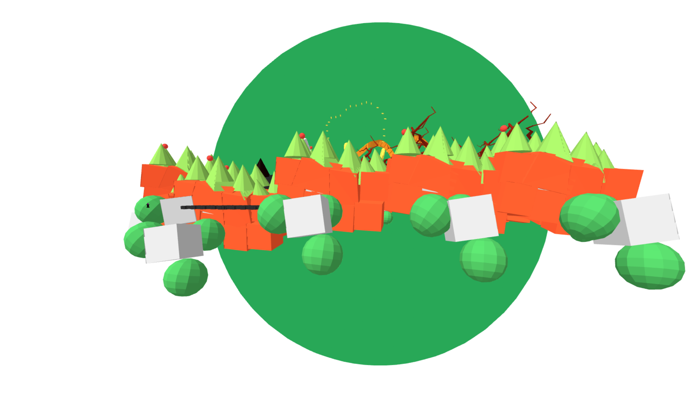
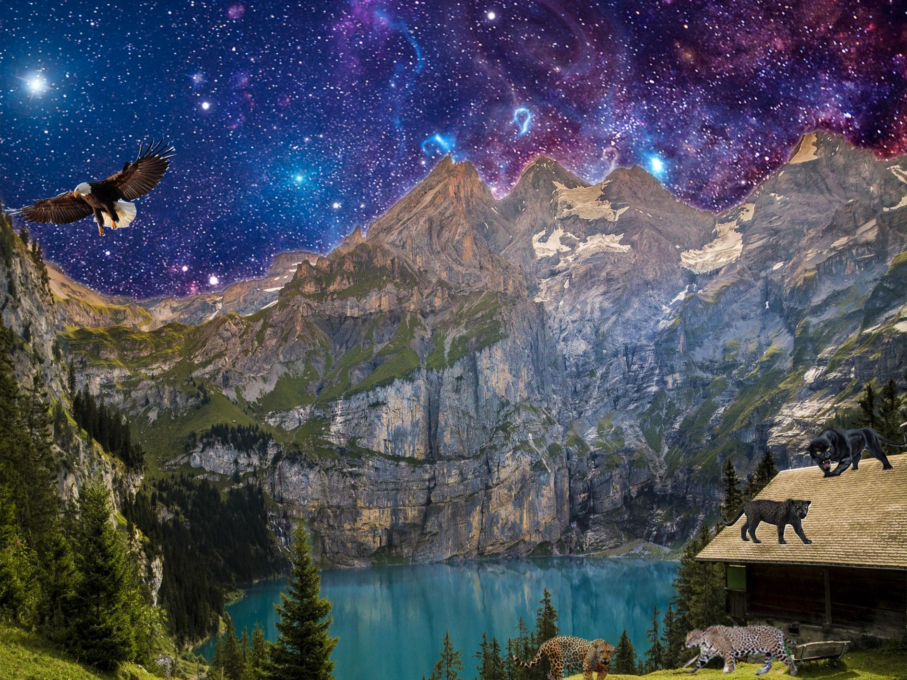
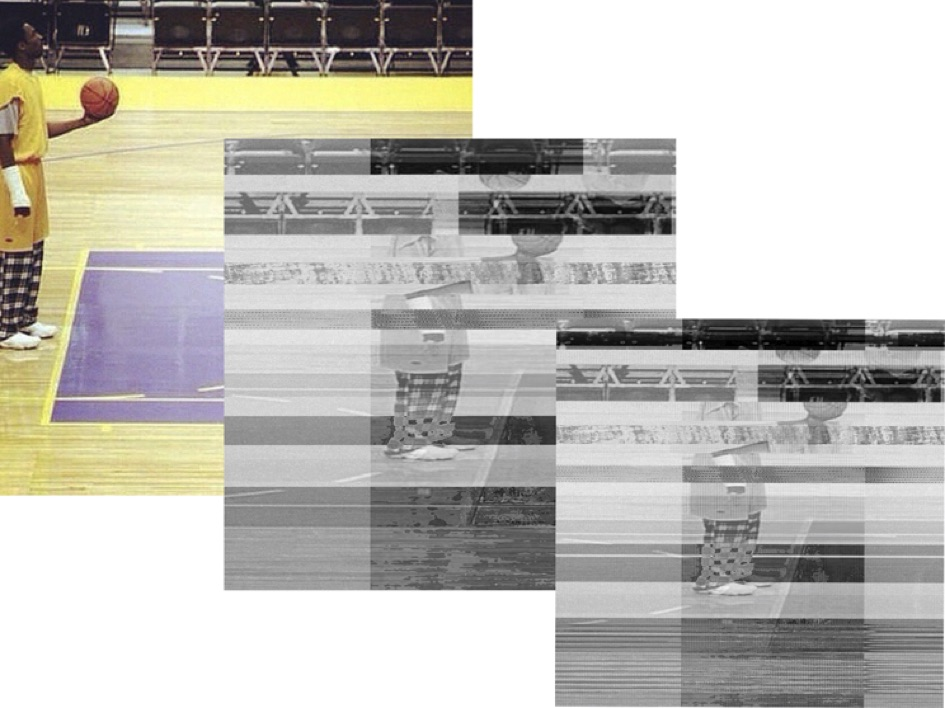

<!DOCTYPE html>
<html lang="en">
  <head>
    <meta charset="UTF-8">
    <meta name="viewport" content="width=device-width, initial-scale=1.0">
    <title>Kwame Glover, Digital Artist + Front-end Developer</title>
    <link href="https://fonts.googleapis.com/css?family=Caveat|Montserrat:400,600&display=swap" rel="stylesheet">
    <link rel="stylesheet" href="styles.css">
  </head>
  <body>
    <main>
      <header>
        

          <h1>Kwame Glover</h1>
          <h2>Digital Media Artist + Front-end Developer</h2>

          
Hello my name is Kwame and I am a 21 year old web developer living in
            San Leandro, California. I am currently attending San Jose State
            Univeristy. I started at SJSU as a Business major with a concentration in Entreprenuership, but I have recently
            decided to change my major to Digital Media Art. So far, I have earned
            my minor in general business  and am working towards getting my
            BFA in Digital Media Art. In my spare time, I enjoy making youtube
            videos about cryptocurrency and am interested in the idea of
            decentralized finance. I am also learning the basics of web
            development including programs such as Python and JavaScript.

          
Please Subsribe to my Youtube Channel  <a href="https://www.youtube.com/channel/UChzGLyBYsvcZU0Y95hxfRPg?themeRefresh=1" target="_blank">CryptoKwam</a>, I make cryptocurrency Technical Anaysis videos and discuss decentralized finance.

        

      </header>

      <!-- ************ PROJECTS / PORTFOLIO  ************** -->
      <section class="projects">
        

          <h2>Featured Projects</h2>
          
View selected projects below. Please feel free to view my Github profile at <a href="https://github.com/glovkwam">Github</a>.

          <!-- Project 1 -->
          <section class="project-item">
            <iframe src="RNDM.html" frameborder="0" scrolling="yes" width="550" height="550" align="left"></iframe>            
            <h3>Spinning Triangle  / With P5js</h3>
            
For this art piece, I used JavaScript to code a spinning trinagle. One thing I like about this piece is that I was able to use angleMode(degrees) to create an afterimage affect for the triangle. 

            <a class="btn" href="" target="_blank">View the source code on P5js</a>
          </section>

          <!-- Project 2 -->
          <section class="project-item">
            <iframe
            src="RNDM2.html"
            frameborder="0"
            scrolling="yes"
            width="550"
            height="550"
            align="left"
          ></iframe> <h3>3Dimensional Flower in P5js</h3>
            
To complete this p5 sketch, I followed a Youtube tutorial from <a href="https://www.youtube.com/watch?v=otvksQKvtMM">Kazuki Umeda</a>The code contains multiple functions and for loops combined with complex calculus. This project was extremely fun to create and I know that following the video tutorial helped strengthen my skills in CSS, HTML, and JavaScript.

            <a class="btn" href="https://editor.p5js.org/kwamglov/sketches/XGBOn1J2w" target="_blank">View the source code on P5js</a>
            <a class="btn" href="https://www.youtube.com/channel/UCACzb9JwH0ppt9Xwcpz9Bmw">Kazuki Umeda</a>

          </section>
          <section class="project-item">
            <iframe
            src="fl.html"
            frameborder="0"
            scrolling="yes"
            width="550"
            height="550"
            align="left"
          ></iframe> <h3>Fireworks in P5js</h3>
            
To complete this p5 sketch, I combined the code of multiple projects and used the JavaScript library to create this sketch. Check out the original pieces here: <a href="https://happycoding.io/tutorials/p5js/creating-classes/fireworks">Happy Coding.io</a>The code uses multiple functions set multiple functions, let statements, and classes or loops to combind multiple P5js artpieces  with complex calculus. This project was extremely fun to create and I know that following the video tutorial helped strengthen my skills in CSS, HTML, and JavaScript.

            <a class="btn" href="https://editor.p5js.org/kwamglov/sketches/XGBOn1J2w" target="_blank">View the source code on P5js</a>
            <a class="btn" href="https://happycoding.io/tutorials/p5js/creating-classes/campfire" target="_blank">let stars;</a>

          </section>
          <section class="project-item">
             
            <h3>3d Wonderland</h3>
            
For this art piece, I worked with three other artist to create a VR wonderland. As a team we used blocks, Aframe.io, and Blender to create a reimagined Alice in Wonderland

            <a class="btn" href="https://github.com/SJSU-CADRE-CLASSES/SJSU_Art_101_F22_02/blob/main/Groups/Kwame_Zuka_James_zak/wonderlandproject/index.html">View the source code on Github</a>
            <a class="btn" href="https://sjsu-cadre-classes.github.io/SJSU_Art_101_F22_02/Groups/Kwame_Zuka_James_zak/wonderlandproject/" target="_blank">Explore the VR World</a>

          </section>
          <section class="project-item">
            <iframe src="fye.html" frameborder="0" scrolling="yes" width="550" height="550" align="left"></iframe>            
            <h3>Butterfly Queen</h3>
            
For this art piece, I used multiple exsisting JavaScript projects to code a butterfly queen. One thing I like about this piece is that I was able to use angleMode(degrees) to create an afterimage affect for the triangle. 

            <a class="btn" href="" target="_blank">View the source code on P5js</a>
          </section>

          <!-- Project 3 -->
          <h1>Photoshop Creations</h1>
          <section class="project-item">
             
            <h3>Animal Sanctuary</h3>
            
This image was made using Adobe Photoshop in 2020. It is title "Animal
              Sanctuary" and is supposed to represent what North America would look
              like if big cats roamed free out in the wild. This project highlights
              what nature could look like if human beings didn't intervene or
              traverse the natural habitats of endagered animals.
 
          </section>
          <section class="project-item">
             
            <h3>Kobe</h3>
            
created using Adobe Photoshop in February 2020 as a
              tribute to Kobe Bryant following his tragic passing.
 
          </section>
        

      </section>
      
      
      <!-- ****************  WORK EXPERIENCE  ******************** -->
      <section class="work-experience">
        

          <h2>Work Experience</h2>
          
See my complete work history on <a href="https://www.linkedin.com/in/kwame-glover-89ab43213/">LinkedIn</a>.

          <!-- Job 1 -->
          <section class="job-item">
            

              <h3>Operations Manager</h3>
              
The Lemonade Bar

              
June 2015-Present

            

            

While working for The Lemonade Bar, I learned to Manage Point of Sale systems, set up the booth, and serve customers. I have also been tasked with using my skills to deescalate and resolve customer disputes.While working for The Lemonade Bar, I learned to Manage Point of Sale systems, set up the booth, and serve customers. I have also been tasked with using my skills to deescalate and resolve customer disputes.
  Skills: Entrepreneurship · Sales Management · New Business Development · Accounting · Enterprise Resource Planning (ERP)
            

          </section>

          <!-- Job 2 -->
          <section class="job-item">
            

              <h3>Math and Reading Tutor</h3>
              
Kumon Math and Reading Center

              
June 2018 - Sep 2019

            

            

              
Assisted in developing math and reading skills for students by promoting critical thinking and grading class work.

                Worked with students ages 5-17 on customized lessons and saw first hand the importance of repetition and practice.

            
              
            

          </section>

          <!-- Job 3 -->
          <section class="job-item">
            

              <h3>Sales Associate</h3>
              
Kohl's

              
Oct 2019 - July 2022

            

            

As an associate at Kohl's I Worked in the Amazon return center and implemented new strategies to improve the work enviornment and overall work experience for my cowokers and I. I also managed customer service desk, the point of sale system, and managed drive-up and pickup orders. Skills: Sales · Business-to-Business (B2B) · New Business Development
              
            

          </section>
        

      </section>

      <!-- *************  EDUCATION & CERTIFICATIONS *********** -->
      <section class="education">
        

          <h2>Education</h2>

          <section>
            <h3>Bishop O'Dowd High School - Oakland, CA</h3>
            
High School Diploma, 2019

          </section>

          <section>
            <h3>San Jose State University - San Jose, CA</h3>
            
Bachelor of Fine Arts, Digital Media Art 2019-Present

            
Minor in General Business, 2022

          </section>

        

      </section>

      <!-- ************  CONTACT INFO / SOCIAL MEDIA  ************ -->
      <footer>
        

          <h2>Let's Keep in Touch!</h2>

          <!-- Social media and contact links. Add or remove any networks. -->
          <ul class="contact-list">
            <li><a href="mailto:email@example.com">gloverkwame@gmail.com</a></li>
            <li><a href="https://www.instagram.com/_k.wam/?hl=en" target="_blank">Instagram</a></li>
            <li><a href="https://www.nftgoapp.com/profile?w=0x4b0e78CDf8A4E62497d134fFC42064179b528886" target="_blank">NFT GO</a></li>
            <li><a href="https://github.com/glovkwam" target="_blank">Github</a></li>
          </ul>
        

      </footer>
    </main>
  </body>
</html>
